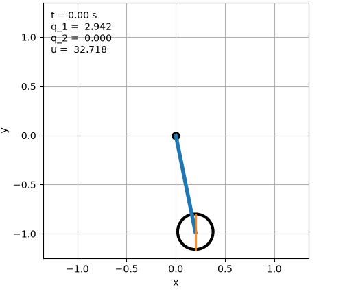

# Parallel Policy-Gradient Methods for Parameter Optimization of Nonlinear Feedback Controllers

| Nominal controller | Our method |
|:---:|:---:|
|  |  |

This repository contains the code and numerical experiments for **“Parallel Policy-Gradient Methods for Parameter Optimization of Nonlinear Feedback Controllers.”**

## Main contributions

- A policy-gradient formulation for discrete-time control-affine nonlinear systems, which is consistent with the deterministic policy gradient in previous work and recovers the standard LQR policy gradient as a special case.
- A time-parallel policy-gradient method based on parallel state and costate trajectory evaluation.
- Stability-based conditions for horizon-uniform convergence guarantees.
- Numerical evaluation on discrete-time LQR and an inertia-wheel pendulum with an IDA-PBC controller.

## Main attractions

| File | Description |
|---|---|
| `deer.py` | General Gauss-Newton trajectory solver \cite{gonzales2020}. |
| `deer_LQR.py` | Implementation used for the LQR experiments. |
| `deer_constant_k_convergence.py` | Constant-gain LQR convergence experiment. |
| `inertia_wheel_pendulum.py` | Inertia-wheel pendulum model and baseline simulation. |
| `inertia_wheel_policy_optimization_deer.py` | Monte Carlo with gradient descent. |
| `inertia_wheel_projected_deer.py` | Monte Carlo with projected gradient descent. |
| `test_time.py` | Timing experiment for sequential and parallel trajectory evaluation. |

## Method

For a parameterized feedback controller $u_k=\pi(x_k,\theta)$, we minimize

$$
\mathcal{J}(x_0,\theta)= \sum_{k=0}^\infty \big(q(x_k) + \pi(x_k,\theta)^\top R \pi(x_k,\theta)\big).
$$

Each policy-gradient iteration:

1. evaluates the closed-loop state trajectory in parallel;
2. evaluates the corresponding costate trajectory in parallel;
3. combines the state and costate information to form the policy gradient; and
4. updates the controller parameters using projected gradient descent (PGD).

## Requirements

The experiments use Python 3 with JAX, NumPy, SciPy, Matplotlib, and Pillow:

```bash
pip install "jax[cpu]" numpy scipy matplotlib pillow
```

## Running the inertia-wheel experiments

Projected gradient descent:

```bash
python inertia_wheel_projected_deer.py
```

The scripts save plots, animations, optimized parameters, and NumPy result files in their respective result directories.

## Citation

Citation information will be added after publication.

## License

See [LICENSE](LICENSE).