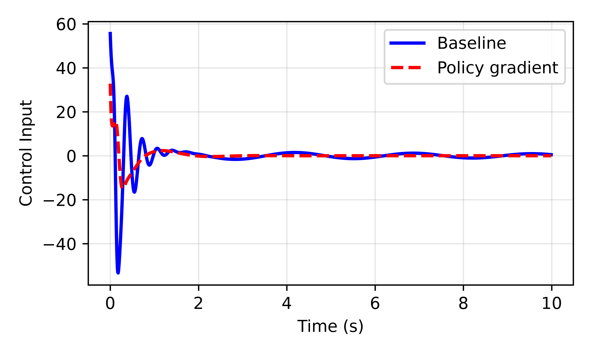

# Parallel Policy-Gradient Methods for Parameter Optimization of Nonlinear Feedback Controllers

This repository contains the code and numerical experiments for **“Parallel Policy-Gradient Methods for Parameter Optimization of Nonlinear Feedback Controllers.”**

We develop a time-parallel framework for optimizing the parameters of structured nonlinear feedback controllers. The forward state and backward costate recursions are reformulated as root-finding problems and evaluated using a two-pass Newton fixed-point method based on DEER. This reduces the parallel depth of trajectory evaluation to $O(\log T)$ while retaining $O(T)$ total work for a horizon of length $T$.

## Main contributions

- A policy-gradient formulation for discrete-time nonlinear control-affine systems.
- Recovery of the discrete-time LQR policy gradient as a special case.
- Two-pass, time-parallel evaluation of state and costate trajectories.
- Stability-based conditions for horizon-uniform convergence guarantees.
- Parameter optimization of an IDA-PBC controller for an inertia-wheel pendulum.

## Inertia-wheel pendulum results

| Gradient descent | Projected gradient descent |
|:---:|:---:|
|  |  |

### Controller-parameter history


### Control-input comparison

The optimized controller reduces the large transient control effort relative to the baseline controller.



## Method

For a parameterized feedback controller $u_k=\pi(x_k,\theta)$, we minimize

$$
J(\theta)=\mathbb{E}_{x_0}\!\left[
\sum_{k=0}^{T-1}\ell(x_k,\pi(x_k,\theta))+\ell_T(x_T)
\right].
$$

Each policy-gradient iteration:

1. evaluates the closed-loop state trajectory in parallel;
2. evaluates the corresponding costate trajectory in parallel;
3. combines the state and costate information to form the policy gradient; and
4. updates the controller parameters using gradient descent (GD) or projected gradient descent (PGD).

## Repository contents

| File | Description |
|---|---|
| `deer.py` | General DEER trajectory solver. |
| `deer_LQR.py` | DEER implementation used for the LQR experiments. |
| `deer_constant_k_convergence.py` | Constant-gain LQR convergence experiment. |
| `inertia_wheel_pendulum.py` | Inertia-wheel pendulum model and baseline simulation. |
| `inertia_wheel_policy_optimization_deer.py` | Monte Carlo two-pass DEER with gradient descent. |
| `inertia_wheel_projected_deer.py` | Monte Carlo two-pass DEER with projected gradient descent. |
| `test_time.py` | Timing experiment for sequential and parallel trajectory evaluation. |

## Requirements

The experiments use Python 3 with JAX, NumPy, SciPy, Matplotlib, and Pillow:

```bash
pip install "jax[cpu]" numpy scipy matplotlib pillow
```

Some auxiliary experiments also expect the project-specific `lle` and `pendulum_env_jax` modules to be available on the Python path.

## Running the inertia-wheel experiments

Unconstrained gradient descent:

```bash
python inertia_wheel_policy_optimization_deer.py
```

Projected gradient descent:

```bash
python inertia_wheel_projected_deer.py
```

The scripts save plots, animations, optimized parameters, and NumPy result files in their respective result directories.

## Citation

Citation information will be added after publication.

## License

See [LICENSE](LICENSE).