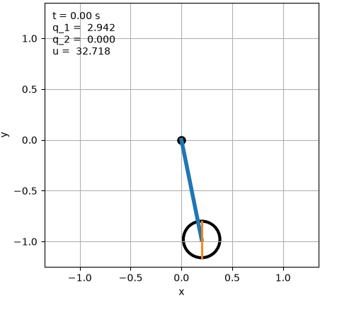
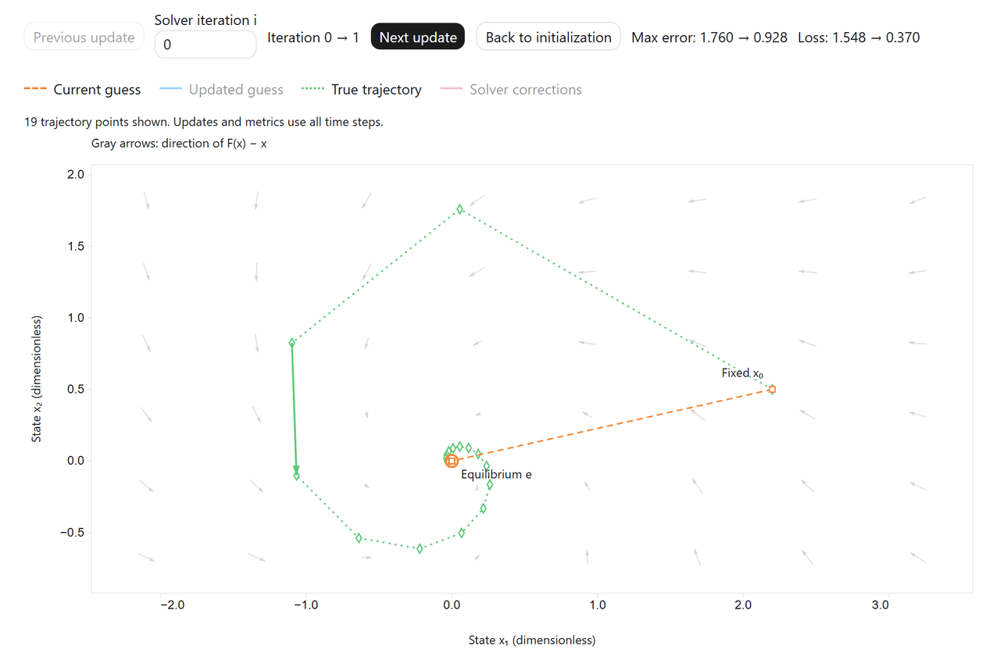

# Parallel Policy-Gradient Methods for Parameter Optimization of Nonlinear Feedback Controllers

[](https://arxiv.org/abs/2609.14114)

| Nominal controller | Our method |
|:---:|:---:|
|  |  |

This repository contains the code and numerical experiments for **[“Parallel Policy-Gradient Methods for Parameter Optimization of Nonlinear Feedback Controllers”](https://arxiv.org/abs/2609.14114)** by An Nguyen and Leilei Cui.

## Interactive demo

<a href="https://lc-lab25.github.io/Parallel-Policy-Gradient/">
  <picture>
    <source media="(prefers-color-scheme: dark)" srcset="img/guess_dynamics_convergence_dark.gif">
    
  </picture>
</a>

**[▶ Try it in your browser](https://lc-lab25.github.io/Parallel-Policy-Gradient/)**

The animation shows the Gauss–Newton (DEER) state solver on the demo's built-in nonlinear system (horizon T = 50, Δt = 0.01, ρ = 0.33, x₀ = (4, 3.8)), starting from a noisy straight-line guess from x₀ toward the equilibrium (σ = 0.05, seed 45). While the guess (orange) is far from the solution, the maximum error stays large: 7.11 → 4.93 → 5.62 → 5.58. Once it is close, convergence is quadratic: 2.23 → 0.88 → 0.073 → 3.4×10⁻⁴ → 2.3×10⁻⁹. After nine updates the guess matches the true closed-loop trajectory (green) to within 10⁻¹⁰, far fewer than the T updates allowed by the finite-step bound.

In the demo you can step through each update, compare Gauss–Newton with clipped Gauss–Newton and gradient descent, or enter your own discrete map or ODE. It is a single static page, [`docs/index.html`](docs/index.html).

## Main contributions

- A policy-gradient formulation for discrete-time control-affine nonlinear systems, which is consistent with the deterministic policy gradient in previous work and recovers the standard LQR policy gradient as a special case.
- A time-parallel policy-gradient method based on parallel state and costate trajectory evaluation.
- Stability-based conditions for horizon-uniform convergence guarantees.
- Numerical evaluation on discrete-time LQR and an inertia-wheel pendulum with an IDA-PBC controller.

## Main attractions

| File | Description |
|---|---|
| `deer.py` | General Gauss-Newton trajectory solver \cite{gonzales2020}. |
| `deer_LQR.py` | Implementation used for the LQR experiments. |
| `deer_constant_k_convergence.py` | Constant-gain LQR convergence experiment. |
| `inertia_wheel_pendulum.py` | Inertia-wheel pendulum model and baseline simulation. |
| `inertia_wheel_policy_optimization_deer.py` | Monte Carlo with gradient descent. |
| `inertia_wheel_projected_deer.py` | Monte Carlo with projected gradient descent. |
| `test_time.py` | Timing experiment for sequential and parallel trajectory evaluation. |

## Method

For a parameterized feedback controller $u_k=\pi(x_k,\theta)$, we minimize

$$
\mathcal{J}(x_0,\theta)= \sum_{k=0}^\infty \big(q(x_k) + \pi(x_k,\theta)^\top R \pi(x_k,\theta)\big).
$$

Each policy-gradient iteration:

1. evaluates the closed-loop state trajectory in parallel;
2. evaluates the corresponding costate trajectory in parallel;
3. combines the state and costate information to form the policy gradient; and
4. updates the controller parameters using projected gradient descent (PGD).

## Requirements

The experiments use Python 3 with JAX, NumPy, SciPy, Matplotlib, and Pillow:

```bash
pip install "jax[cpu]" numpy scipy matplotlib pillow
```

## Running the inertia-wheel experiments

Projected gradient descent:

```bash
python inertia_wheel_projected_deer.py
```

The scripts save plots, animations, optimized parameters, and NumPy result files in their respective result directories.

## Paper

An Nguyen and Leilei Cui, “Parallel Policy-Gradient Methods for Parameter Optimization of Nonlinear Feedback Controllers,” arXiv:2609.14114, 2026.

[arXiv page](https://arxiv.org/abs/2609.14114) · [PDF](https://arxiv.org/pdf/2609.14114)

## Citation

If you use this code, please cite the paper:

```bibtex
@misc{nguyen2026parallelpolicygradientmethodsparameter,
  title={Parallel Policy-Gradient Methods for Parameter Optimization of Nonlinear Feedback Controllers},
  author={An Nguyen and Leilei Cui},
  year={2026},
  eprint={2609.14114},
  archivePrefix={arXiv},
  primaryClass={eess.SY},
  url={https://arxiv.org/abs/2609.14114},
}
```

## License

See [LICENSE](LICENSE).